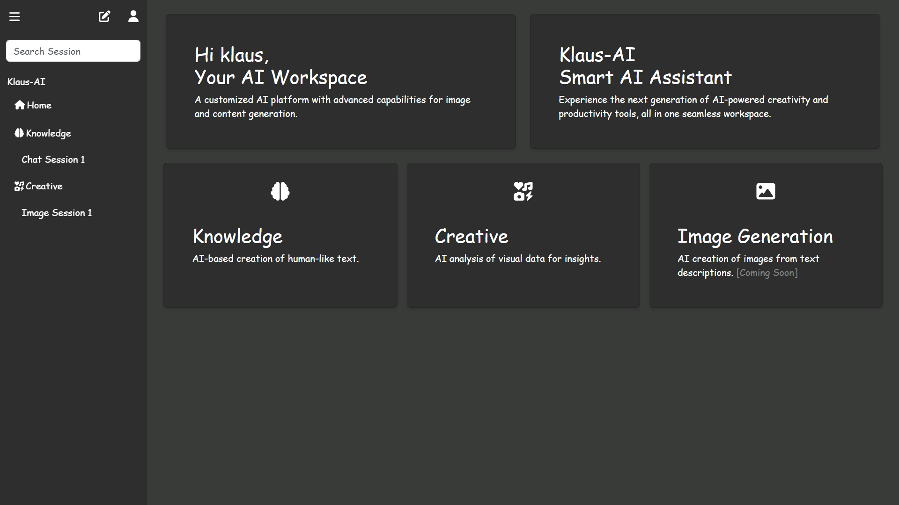

# ChatGPT Clone using Gemini AI API

This project is a ChatGPT clone built using the **Gemini AI API**, designed to deliver intelligent conversational experiences. The application provides real-time, context-aware responses, demonstrating the power of advanced AI tools in creating interactive chatbot solutions. This clone showcases seamless integration of modern AI capabilities in a user-friendly interface.

# Features
    Provides human-like, context-aware responses.
    Offers quick and dynamic responses in real-time.
    A clean and intuitive interface for seamless user interaction.
    Maintains the context of ongoing chats for a coherent experience.
    Easy to extend with additional features and tailored functionalities.
    Upload Image files from the frontend.
    Process and analyze images on the backend using AI capabilities.
    Display analyzed data, such as detected labels or content descriptions, on the frontend.

# Tech

## Backend  
    [Gemini_AI_API/Express.js]

## Frontend
    [React.js/HTML/CSS/Bootstrap.css]

# Prerequisites
    Node.js installed on your system.
    A valid API key for the Google Cloud Vision API (or Gemini AI API).

# Installation and Setup

## Clone the Repository
    
    git clone https://github.com/veeraj2404/gemini-ai.git
    cd gemini-ai
    
## Set Up the Backend
Create a .env file in the backend directory with the following content:
    API_KEY=[GOOGLE_AI_KEY]

    cd backend
    npm install
    npm run dev
    [http://localhost:3001]

## Set Up the Frontend

    cd frontend
    npm install
    npm start
    [http://localhost:3000]

# Project Structure

    gemini-ai/
    ├── backend/
    |   ├──src/
    │   |   ├── server.js      # Node.js backend logic
    |   |   ├── models/        # Models folders
    |   |   ├── connection/    # db connection
    |   |   ├── routes/        # api routes
    │   ├── .env               # Environment variables (ignored in version control)
    │   ├── package.json       # Backend dependencies
    │   └── ...                # Other backend files
    ├── frontend/
    │   ├── src/
    |   |   ├── Assets         # Assets
    │   │   ├── Components/    # Application component [Home/Login/SideNavbar/TextGenerator]
    │   │   ├── App.js         # Main React app entry
    │   │   └── ...            # Other frontend files
    │   ├── package.json       # Frontend dependencies
    │   └── ...                # Other frontend files
    ├── .gitignore             # Git ignore file
    └── README.md              # This README file

## API References
1. Google Cloud Vision API Documentation:
   https://cloud.google.com/vision/docs
2. Gemini AI API (when available):
   Gemini AI Documentation (https://aistudio.google.com/)

## Acknowledgments
Thanks to Google Cloud Vision API for providing powerful image analysis tools.
Inspired by modern AI capabilities in Gemini AI.